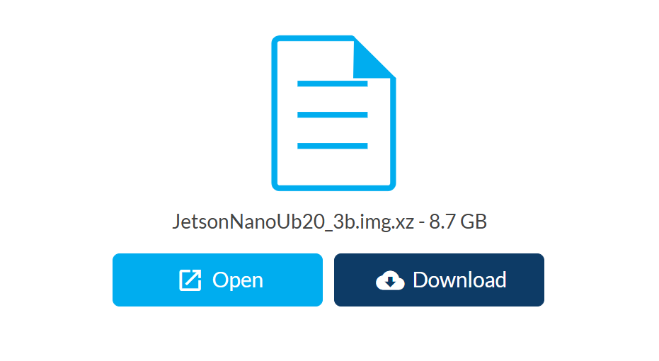
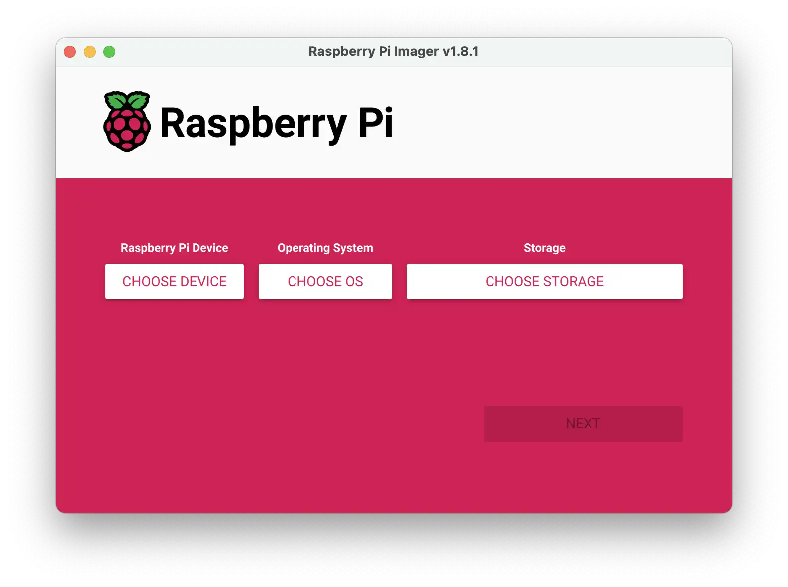

# Upgrade Limo

Limo ROS1 버전을 ROS2로 업그레이드하는 방법을 소개합니다.

- 준비물: sd카드 (64기가 권장)

## [1] sd카드에 Image 굽기
1. [**JetsonNano Ubuntu20.04 Image**](https://ln5.sync.com/dl/403a73c60/bqppm39m-mh4qippt-u5mhyyfi-nnma8c4t/view/default/14418794280004)를 다운받습니다.

1. [**Raspberry Pi Imager**](https://www.raspberrypi.com/software/)를 설치후 실행합니다.

1. Image를 sd카드에 굽습니다.
    - 장치 선택 (CHOOSE DEVICE): 선택 안함
    - 운영체제 선택 (CHOOSE OS): Use custom을 선택한 후 다운로드 받은 'JetsonNano Ubuntu20.04 Image'를 선택합니다.
    - 저장소 선택: 준비한 sd카드를 선택합니다.

## [2] sd카드 교체

위에서 구운 sd카드를 limo차량에 교체 삽입합니다.


## [3] 설치 및 환경구성

limo 차량을 부팅한 후 아래 내용을 수행합니다.

1. 인터넷 연결

1. ROS2 Foxy 설치?

1. 그래픽 드라이버?

1. Ackermann Steering 세팅?

1. 파티션 확장

1. 패키지 설치


1. Swap 메모리 확장
    ```bash
    # 원하는 크기 만큼 빈 파일 생성 (8G)
    sudo fallocate -l 8G /swapfile
    # 파일 권한 설정
    sudo chmod 600 /swapfile
    # 스왑 영역으로 포맷하기
    sudo mkswap /swapfile
    # 스왑 활성화하기
    sudo swapon /swapfile
    # 부팅 시 자동으로 스왑 켜기
    grep -qxF '/swapfile none swap sw 0 0' /etc/fstab || echo '/swapfile none swap sw 0 0' | sudo tee -a /etc/fstab
    ```