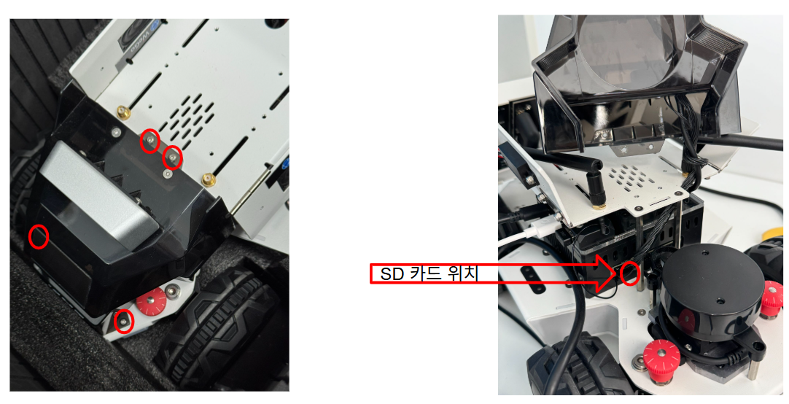

# Upgrade Limo

Limo ROS1 버전을 ROS2로 업그레이드하는 방법을 소개합니다.

## [방법 1] 사전에 세팅된 이미지를 사용하기

1. [사전 세팅된 Image]()를 다운받습니다.
1. [Raspberrypi Imager](https://www.raspberrypi.com/software/)를 사용하여 다운로드한 Image를 sd카드에 굽습니다.
1. SD 카드 교체하기 (육각렌치로 분해)
    

## [방법 2] 직접 이미지를 만들고 설치하기

### 1.1. sd카드에 Image 굽기
1. [JetsonNano Ubuntu20.04 Image](https://ln5.sync.com/dl/403a73c60/bqppm39m-mh4qippt-u5mhyyfi-nnma8c4t/view/default/14418794280004)를 다운받습니다.
1. [Raspberrypi Imager](https://www.raspberrypi.com/software/)를 사용하여 다운로드한 Image를 sd카드에 굽습니다.

### 1.2. 설치
- ROS2 Foxy를 포함하여 필요한 패키지를 설치합니다.
- [upgrade_limo (WeGo)](https://github.com/WeGo-Robotics/upgrade_limo)

### 1.3. Image 뜨기 (옵션)

- 세팅이 완료된 sd카드를 [참고자료](https://blog.naver.com/todigital/222214247049)를 통해 이미지 파일로 생성합니다.
- 이를 통해 같은 환경의 여러 sd카드를 생성하여 다양한 기기에 동일한 환경으로 접속할 수 있게 도와줍니다.